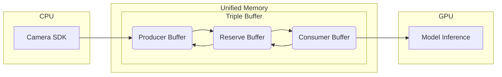

# irmv_detection
A hardware-accelerated (for NVIDIA GPUs) armor detection ROS2 node for RoboMaster competition.

## Requirements
- ROS2 Humble
- JetPack 6

## Performance Benchmark
|                Model                 | Input Size | Inference Time* <br> (Jetson Orin Nano 8GB) | Inference Time* <br> (RTX 3060 Laptop 115W) |
| :----------------------------------: | :--------: | :-----------------------------------------: | :-----------------------------------------: |
|               YOLOv8n                |  640x640   |                    ~5ms                     |                   ~ 4-5ms                   |
| YOLOv8n <br> (Shufflenet backbone)** |  640x640   |                    ~5ms                     |                   ~ 3-4ms                   |

*: The inference time includes the time for image preprocessing and postprocessing (NMS).

**: https://github.com/zRzRzRzRzRzRzR/YOLO-of-RoboMaster-Keypoints-Detection-2023

Note that due to use of Unified Memory, the performance on dGPU devices is not ideal. However this enables true zero-copy on Tegra (e.g. Jetson) devices, potentially reducing the latency of image transfer between CPU and GPU.

Disclaimer: The results are obtained from `yolo_engine_benchmark` in `test/yolo_test.cpp`, and they do not necessarily reflect the actual performance when used in a ROS2 node.

## Acceleration Techniques
Below are techniques used or planned to use in this package to accelerate the inference process (some of them are still under development):
- [x] TensorRT (FP16)
- [x] GPU Postprocessing (with EfficientNMS plugin from TensorRT)
- [x] GPU Preprocessing (with NPP from CUDA Toolkit)
- [x] CUDA Streams
- [x] CUDA Graphs
- [ ] Custom CUDA kernel for resizing
- [ ] INT8 Quantization

## Design Ideas


### Unified Memory: Zero-Copy Data Transfer between CPU and GPU

On Jetson devices, CPU and GPU share the same memory space. This allows the use of Unified Memory to achieve true zero-copy data transfer. However, this does not come without a cost. These unified memory buffers must be allocated with CUDA API calls, which means that we can no longer utilize ROS2 topic system to transfer data between camera and detector. Instead, we must integrate the camera SDK into the detector node.

### Triple Buffering: Lock-Free Pipelining
The relation between camera and detector is a classic producer-consumer problem. Typically,they are solved with message queues. However, message queues are not viable in our context, as they require copying in and out of the queue, violating the zero-copy principle. And the arbitrary size of the queue also makes it troublesome in CUDA context, as allocating and deallocating unified memory is relatively expensive and changing memory addresses in CUDA graph nodes is very expensive (at least 2ms on Jetson). We could, however, use a mutex and a conditional variable to solve the producer-consumer problem. But this approach is not actual pipelining, as the producer and consumer will never run at the same time.

To address all of the considerations above, we used triple buffering to solve this problem. The consumer is free to ignore any previous frames, and the producer is free to overwrite any previous frames. The producer will never be blocked by the consumer, and the consumer will only wait if the producer is not keeping up the pace (which in this case, waiting is desired). In addition, swapping buffers can be implemented lock-free with `std::atomic`, making the producer a lot faster. The waiting part of the consumer cannot be lock-free, but we used atomic waiting from C++20 to minimize the overhead.

An example of the triple buffering scheme is shown below:

```mermaid
gantt
   dateFormat  SSS
   axisFormat  %L ms
   section Producer
   P1: 000, 002
   P2: 005, 007
   P3: 010, 012
   P4: 015, 017
   P5: 020, 022
   P6: 025, 027
   P7: 030, 032
   P8: 035, 037

   section Consumer
   C1: 002, 011
   C2: 011, 017
   C4: 017, 021
   C5: 022, 027
   C6: 027, 032
   C7: 032, 037
```



## Troubleshooting

1. Model inference taking much longer than expected.

   By default, NVIDIA GPUs will run at a low clock rate when the GPU is idle. This is not ideal for competition environment. To solve this problem, you can use the following command (on Jetson only) to set the GPU clock rate to the maximum value:
    ```bash
    sudo jetson_clocks
    ```
    If you're using a dGPU (e.g. RTX 3060), you can use the following command to force the GPU clock rate to the maximum value:
    ```bash
    sudo nvidia-smi -lgc <MAX CLOCK RATE>
    ```
    Use `nvidia-smi -q -d SUPPORTED_CLOCKS` to check the supported clock rates.
    Fore more info on this: [https://stackoverflow.com/questions/64701751/can-i-fix-my-gpu-clock-rate-to-ensure-consistent-profiling-results](https://stackoverflow.com/questions/64701751/can-i-fix-my-gpu-clock-rate-to-ensure-consistent-profiling-results)